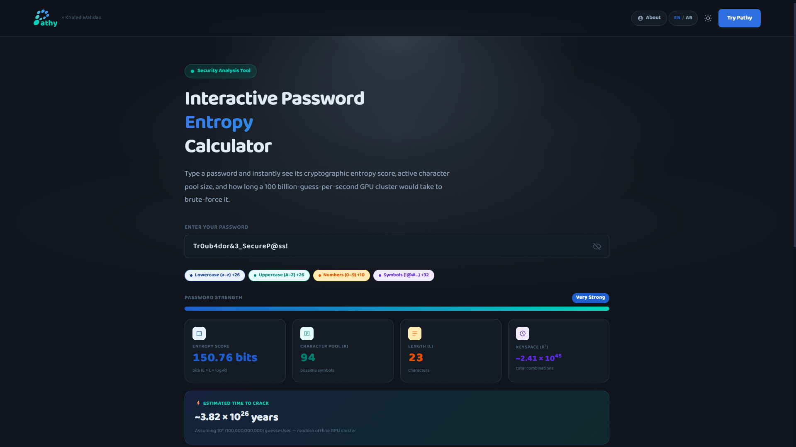
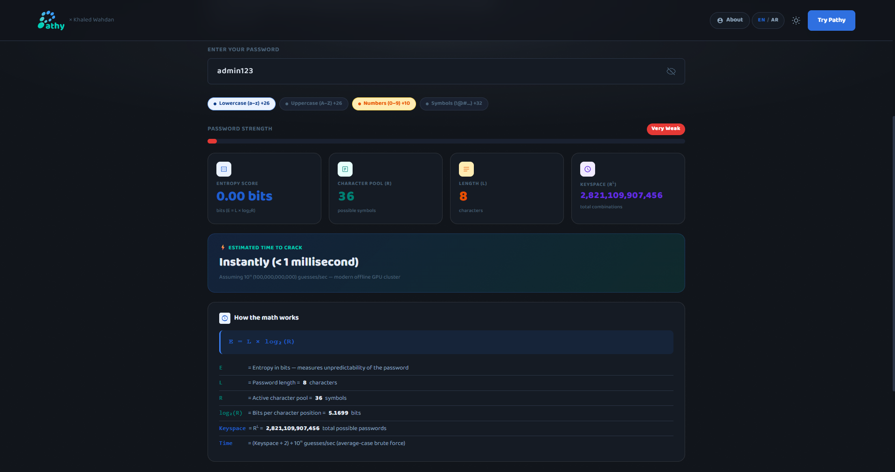
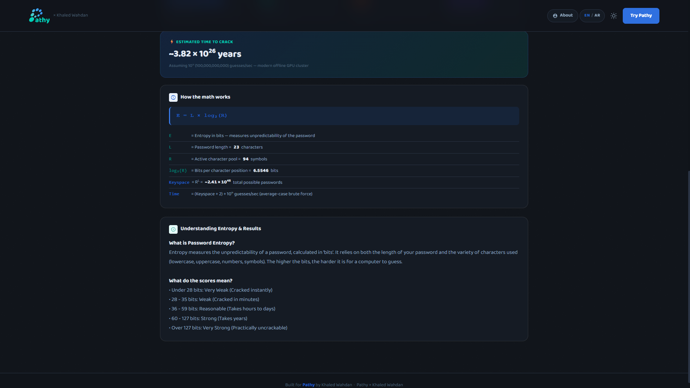
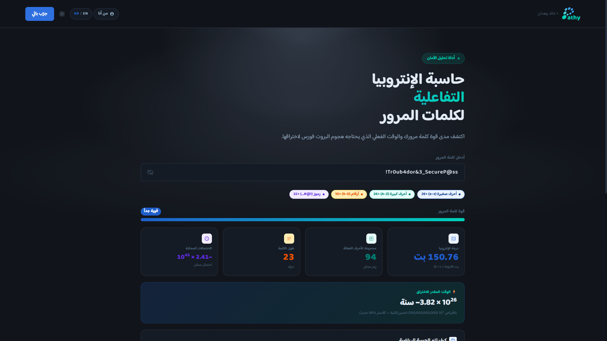
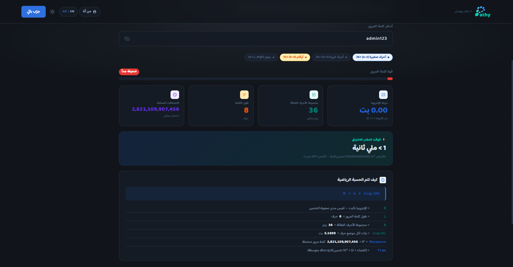
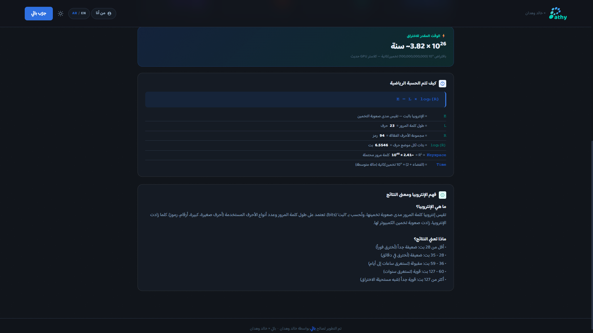

# Khaled Wahdan x Pathy: Interactive Password Entropy Calculator 🔐

---

   
  
    

## 📖 The Story Behind the Project

Hello! I am Khaled Wahdan, an undergraduate Cybersecurity student at Umm Al-Qura University. 
I built this project as the core requirement to earn my professional certification in **AI Software Development from eYouth and IBM (presented in partnership with Pathy)**.

When tasked with building an AI-assisted web application for the certification, I didn't want to make a low-effort website just to pass the bar. I wanted to challenge myself by thinking of a cool idea that i can learn and gain practical experience by implementing. I decided i want to make a website that solves a problem in the cyber world. That's when i noticed that standard password strength meters act as a **"Black Box."**. By forcing the user to meet a checklist (one capital letter, one number, one symbol.) then show a label. This creates a false sense of security because the user never learns *why* length and variation matter.

My philosophy for this project was: **Eliminate the illusion of security by exposing the math.**
This tool visualizes the cryptographic entropy in real-time, simulating how long a modern GPU cluster (processing 100 billion guesses per second) would take to brute-force a password. I designed it directly in the Pathy.live UI theme as a tribute to the platform that facilitated my learning, with full rights given to the Pathy team to utilize it as an educational tool or course benchmark in the future.

## ⚙️ How I Built It (The AI Workflow)

Instead of manually writing the HTML/CSS, I adopted the role of a **Lead Architect and Security Auditor**. I used generative AI (AntiGravity / Claude) to write the structural code based on strict mathematical formulas and I provided:`E = L × log2(R)`.

However, relying entirely on AI for security tools is inherently risky. I had to manually audit, debug, and enhance the code to make it production-ready.
## 🛠️ Issues Faced & Technical Fixes

During development, I encountered and resolved several critical UI and logic issues:

1.  **Predictability:**
    *   *The Issue:* The AI successfully implemented flawless entropy mathematics. However, math is blind to human ignorance. If a user typed a common string like `admin123`, the math scored it as reasonably secure just because of its length.
    *   *The Fix:* I intervened as the Security Auditor to patch this logical vulnerability. I implemented a security layer that checks for common dictionary patterns, dropping the entropy score to zero for predictable inputs, bridging the gap between theoretical math and practical security.

    > **Visual Proof:** Notice how the dictionary string `admin123` is instantly flagged as 0 bits, completely overriding the standard length calculation.
    >  
    > 

2.  **Language Switcher Glitch & RTL Support:**
    *   *The Issue:* The initial bilingual (English/Arabic) implementation caused a jarring, abrupt flash when swapping text and switching the DOM from `dir="ltr"` to `dir="rtl"`. Furthermore, clicking individual language text spans sometimes failed or bubbled incorrectly.
    *   *The Fix:* I engineered a smooth CSS transition (`.fade-content { transition: opacity 0.3s ease; }`) tied to JavaScript event listeners with explicit click delegation for both text wrappers (`ltEn` and `ltAr`). The DOM now gracefully fades out, swaps the language, fixes unit ordering (e.g., ensuring "بت" and "سنوات" appear properly to the right of the numbers), and fades back in.

3.  **Accessibility Contrast:**
    *   *The Issue:* Dynamic security badges generated by the AI lacked proper contrast (e.g., dark text on a dark background for the "Very Strong" rating).
    *   *The Fix:* Refactored the CSS to enforce strict contrast ratios (`#ffffff` on dark backgrounds) to meet web accessibility standards.

## 🚀 Features

*   **Zero-Backend Architecture:** 100% client-side vanilla JavaScript. No data is sent to any server, ensuring complete privacy.
*   **Real-Time Telemetry:** Instant calculation of Character Pool (R), Password Length (L), and Keyspace.
*   **Bilingual & Localized:** Fully interactive English and Saudi Arabic translation with dynamic RTL/LTR layout flipping.
*   **Educational Module:** Built-in bilingual explanations of Information Theory, Entropy, and standard security strength brackets.

    > **Educational Breakdown:** The tool dynamically maps user inputs to the actual cryptographic math, explaining the concepts transparently without hiding behind a "black box."
    >  
    > 

---

<h1 dir="rtl" style="text-align: right;">خالد وهدان x باثي : حاسبة الإنتروبيا التفاعلية لكلمات المرور 🔐</h1>

   
  
    

## 📖 القصة خلف المشروع

السلام عليكم ورحمة الله وبركاته! أنا خالد وهدان، طالب أمن سيبراني في جامعة أم القرى. طوّرت هذا المشروع كمتطلب أساسي لأخذ الشهادة الاحترافية في تطوير برمجيات الذكاء الاصطناعي من إيه يوث وآي بي إم (بالشراكة مع منصة باثي).

لما طلبوا مني ابني موقع بمساعدة الذكاء الاصطناعي عشان اخذ الشهادة، ما كنت أبغى أسوي موقع عابر بس عشان أجتاز. حبيت أتحدي نفسي وأفكر في فكرة ممتازة أتعلم منها وأكسب خبرة عمليّة من خلال تطبيقها. قررت أسوي موقع يحل مشكلة في العالم السيبراني. ومن هنا لاحظت إن مقاييس قوة كلمات المرور العادية تشتغل كـ "صندوق أسود"؛ بحيث تجبر المستخدم يحط شروط معينة (حرف كبير، رقم، رمز) وبعدها تطلع له تقييم. هالشيء يخلق شعور كاذب بالأمان لأن المستخدم ما يتعلم ليش الطول والتنوع مهمين أساساً.

فلسفتي في هالمشروع كانت واضحة: **انهي وهم الأمان عن طريق كشف المعادلات.** هذي الأداة تجسد الإنتروبيا التشفيرية بشكل لحظي، وتحاكي الوقت اللي بتاخذه مجموعة معالجات رسومية حديثة تعالج مئة مليار تخمين في الثانية عشان تسوي هجوم بروت فورس على كلمة المرور. صممت الواجهة بالكامل على واجهات باثي كنوع من الشكر والتقدير للمنصة اللي سهلت لي طريق التعلم، مع إعطاء فريق باثي كامل الصلاحيات لاستخدامها كأداة تعليمية أو كمقياس للدورات مستقبلاً.

## ⚙️ كيف بنيت المشروع (سير عمل الذكاء الاصطناعي)

بدل ما أكتب أكواد التصميم يدوياً، أخذت دور المهندس الرئيسي ومدقق الأمان. استخدمت الذكاء الاصطناعي التوليدي عشان يكتب الهيكل الأساسي بناءً على معادلات رياضية صارمة عطيته إياها.

لكن، الاعتماد الكلي على الذكاء الاصطناعي في أدوات الأمان يعتبر خطورة بحد ذاته. عشان كذا اضطررت أدقق الكود يدوياً، وأصلح الأخطاء، وأحسنه عشان يصير جاهز للاستخدام الفعلي.

## 🛠️ المشاكل اللي واجهتها والإصلاحات التقنية

خلال فترة التطوير، واجهت وحللت عدة مشاكل برمجية ومنطقية أساسية:

<strong>1. التنبؤ البشري:</strong>

<ul dir="rtl" style="text-align: right; padding-right: 20px; list-style-type: disc;">
  <li><strong>المشكلة:</strong> الذكاء الاصطناعي قدر يطبق رياضيات الإنتروبيا بشكل مثالي، لكن الرياضيات ما تفهم الجهل البشري! لو المستخدم كتب كلمة شائعة، المعادلة راح تقيمها على إنها آمنة لمجرد إن طولها مناسب.</li>
  <li><strong>الحل:</strong> تدخلت بصفتي المدقق الأمني عشان أصلح الثغرة المنطقية. سويت طبقة حماية تتحقق من كلمات القاموس الشائعة، وتصفر نقاط الإنتروبيا للمدخلات المتوقعة، وبكذا سويت جسر يربط بين الرياضيات النظرية والأمان الواقعي.</li>
</ul>

<table dir="rtl" style="width: 100%; border-collapse: collapse; border: none; background-color: rgba(57, 124, 237, 0.05); margin: 15px 0;">
  <tr>
    <td style="border-right: 4px solid #397ced; border-left: none; padding: 12px 15px; text-align: right; color: #8fa8c0;">
      <strong>إثبات بصري:</strong> لاحظ كيف إن الكلمة الشائعة تتصفر فوراً وتصير صفر بت، ويتلغي حساب الطول العادي تماماً.
        
      
    </td>
  </tr>
</table>

<strong>2. مشكلة تبديل اللغة ودعم الاتجاه من اليمين لليسار:</strong>

<ul dir="rtl" style="text-align: right; padding-right: 20px; list-style-type: disc;">
  <li><strong>المشكلة:</strong> التطبيق في البداية كان يسوي وميض مزعج وقت ما نغير النص ونقلب اتجاه الصفحة. غير كذا، أحياناً الضغط على نصوص اللغة نفسها ما كان يستجيب صح.</li>
  <li><strong>الحل:</strong> طوّرت انتقال سلس بالـتنسيقات وربطته بمستمعات أحداث برمجية مع تخصيص النقر لواجهات تبديل النصوص. الحين الصفحة تسوي تلاشي ناعم، تبدل اللغة، وترتب الوحدات بالشكل الصح (مثل التأكد إن كلمتي "بت" و "سنوات" تطلع على يمين الأرقام تماماً)، وبعدها ترجع تظهر بنعومة.</li>
</ul>

<strong>3. تباين الألوان وإمكانية الوصول:</strong>

<ul dir="rtl" style="text-align: right; padding-right: 20px; list-style-type: disc;">
  <li><strong>المشكلة:</strong> شارات الأمان اللي طلعها الذكاء الاصطناعي كانت تفتقر للتباين الكافي (مثلاً نص غامق على خلفية غامقة في تقييم "قوية جداً").</li>
  <li><strong>الحل:</strong> عدلت على التنسيقات عشان أضمن نسب تباين واضحة وصارمة عشان تطابق معايير الوصول العالمية للويب.</li>
</ul>

## 🚀 المميزات

<ul dir="rtl" style="text-align: right; padding-right: 20px; list-style-type: disc;">
  <li><strong>بنية بدون سيرفر:</strong> الموقع يشتغل مئة بالمئة جهة المتصفح. ما فيه أي بيانات ترسل لأي سيرفر، وهالشي يضمن خصوصيتك التامة.</li>
  <li><strong>تحليل لحظي:</strong> حساب فوري لمجموعة الأحرف، طول كلمة المرور، وفضاء الاحتمالات.</li>
  <li><strong>ثنائي اللغة ومحلي بالكامل:</strong> ترجمة تفاعلية متكاملة مع قلب ديناميكي لاتجاه الصفحة وأزرار سلسة.</li>
  <li><strong>وحدة تعليمية مدمجة:</strong> شروحات مدمجة لنظرية المعلومات، الإنتروبيا، ومستويات معايير قوة كلمات المرور.</li>
</ul>

<table dir="rtl" style="width: 100%; border-collapse: collapse; border: none; background-color: rgba(0, 208, 184, 0.05); margin: 15px 0;">
  <tr>
    <td style="border-right: 4px solid #00d0b8; border-left: none; padding: 12px 15px; text-align: right; color: #8fa8c0;">
      <strong>تفصيل تعليمي:</strong> الأداة تربط مدخلات المستخدم بالرياضيات التشفيرية الحقيقية بشكل مباشر، وتشرح المفاهيم بكل شفافية بدون ما تتخبى خلف مفهوم الصندوق الأسود.
        
      
    </td>
  </tr>
</table>

---

**[⬆ العودة للأعلى / Back to top](#english-version)**

